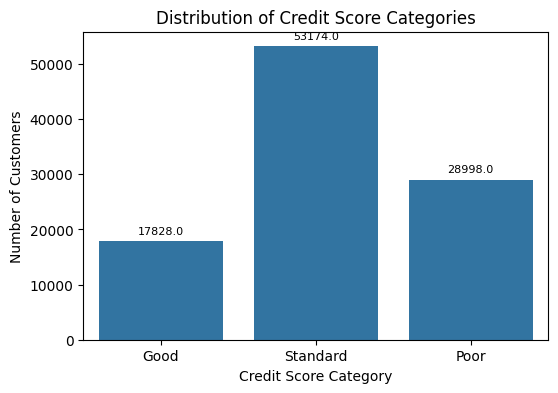
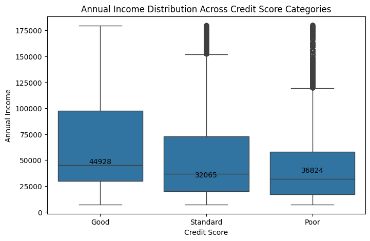
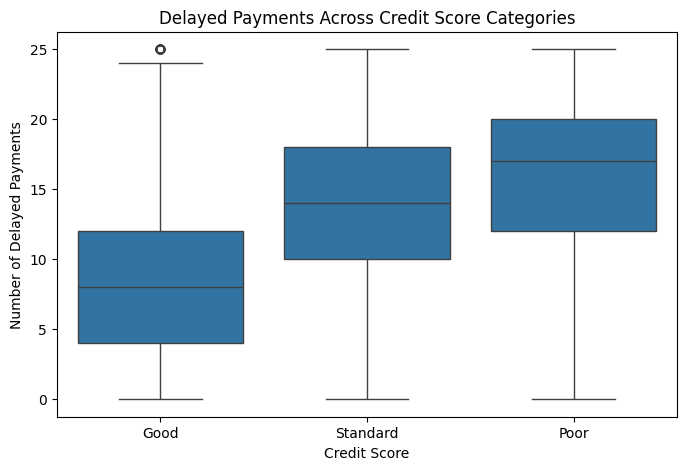
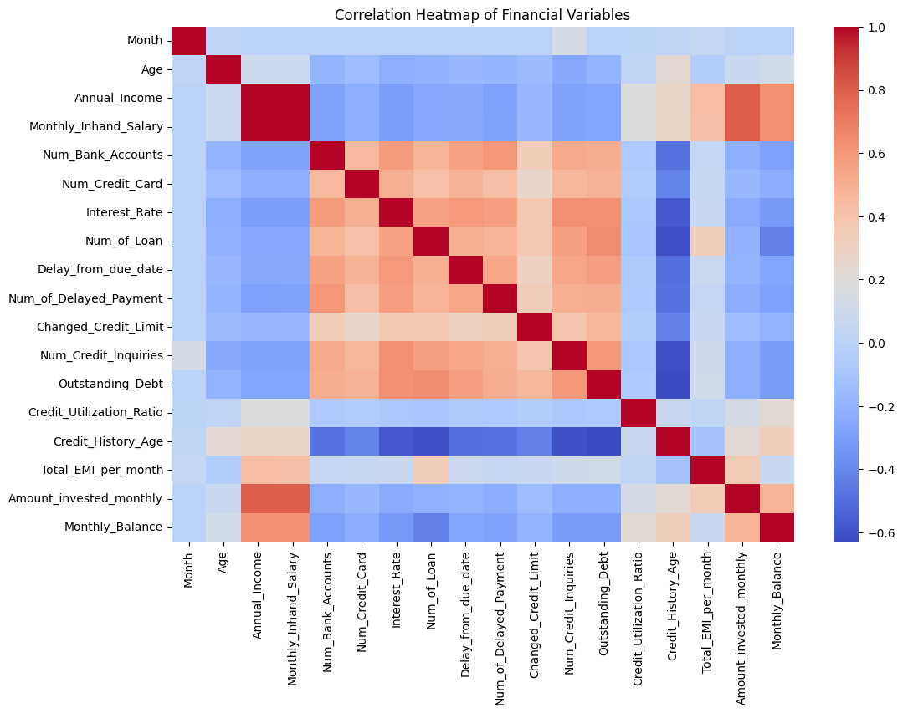
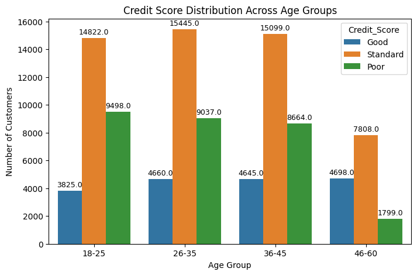

## Dataset

The dataset used in this project contains 100,000 customer financial records used for credit score analysis.

Due to file size limitations, the dataset is not included in this repository.

# Credit Score Analysis & Risk Insights (FinTech Domain)

## Project Overview

This project analyzes customer financial data to identify the key factors influencing credit scores. Using exploratory data analysis (EDA), the project examines how income, payment behavior, credit history, and credit utilization impact customer creditworthiness.

The goal is to extract actionable insights that can support better credit risk assessment and lending decisions for financial service platforms.

---

## Dataset

The dataset contains **100,000 customer financial records** including information about income, credit utilization, payment behavior, loan obligations, and credit history.

Key features include:

* Annual Income
* Monthly Salary
* Number of Loans
* Outstanding Debt
* Credit Utilization Ratio
* Number of Delayed Payments
* Credit History Age
* Credit Mix
* Credit Score Category (Good / Standard / Poor)

---

## Tools & Technologies

* Python
* Pandas
* NumPy
* Matplotlib
* Seaborn
* Google Colab

---

## Key Analysis Performed

* Data cleaning and preprocessing
* Exploratory Data Analysis (EDA)
* Correlation analysis
* Customer segmentation
* Financial behavior analysis

---

## Key Insights

* **53,174 customers** fall into the *Standard* credit score category, indicating moderate creditworthiness.
* Customers with **higher income (~44k median)** tend to maintain better credit scores.
* Customers with **more delayed payments (~17 median)** often fall into the *Poor* credit category.
* **Longer credit history (~290 months median)** strongly correlates with higher credit scores.
* A **balanced credit mix** significantly increases the likelihood of achieving a good credit score.

---

## Example Visualizations

### Credit Score Distribution

### Income vs Credit Score

### Delayed Payments vs Credit Score

### Correlation Heatmap

### Age Group vs Credit Score

---

## Project Structure

credit-score-analysis/
│
├── credit_score_analysis.ipynb
├── credit_score_dataset.csv
├── README.md
└── screenshots/

---

## Business Value

This analysis helps financial institutions:

* Identify high-risk borrowers
* Understand key drivers of credit scores
* Improve credit risk assessment
* Support data-driven lending decisions
